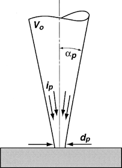
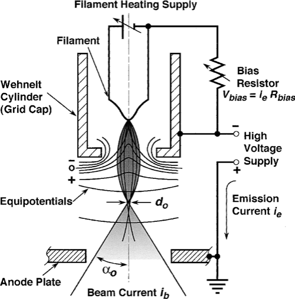
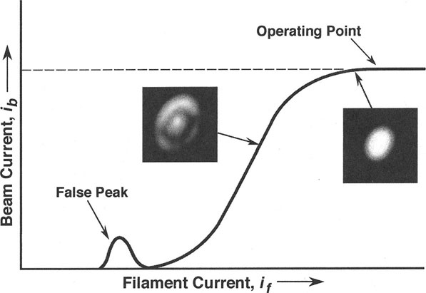
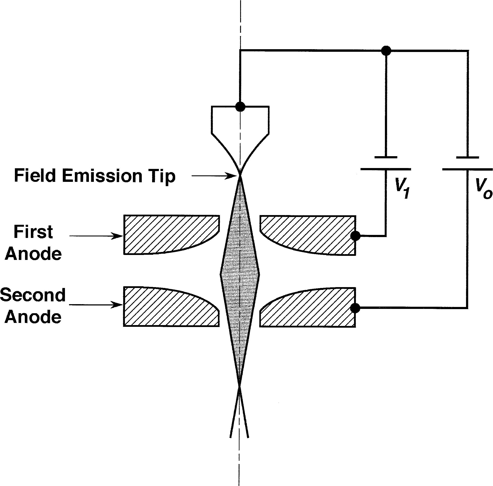

# 扫描电镜及其工作模式

## SEM工作原理

### 各部件功能

- 镜筒electron column
	- Electron Gun电子枪
		- Filament灯丝
	- Scan Coil扫描线圈
	- Electron Lenses电磁透镜
	- Specimen Stage样品台
	- Electron Detector探测器
- 控制台control console
	- 控制按钮
	- 显示器
	- 相机

#### 产生小电子束

电子枪产生电子，加速到0.1~30keV。电磁透镜将束斑会聚到10 nm内的小尺寸。电子束最终作用到样品表面1微米深度内，产生信号。

#### 偏转放大控制系统

扫描图像由一个个点构成，系统通过偏转线圈操控电子束在样品表面逐行扫描，与显示器CRT上的扫描同步。放大倍数为二者扫描步长之比，需要增大放大倍数时只需降低偏转线圈电流即可。

> 偏转控制系统。扫描生成器生成扫描的栅格，分别交给扫描线圈及显示器CRT。放大系统控制偏转线圈电流以控制放大倍数；探测器产生的信号经放大后交给CRT电子枪，控制发射强度。
> 
> （这东西现在应该已经被数字化了吧）

> 扫描线圈的工作原理：第一组偏转线圈令电子束偏离光轴，第二组再令电子束偏回来，与光轴重新相交的点称为中轴点(pivot point)。实际的放大倍数还与样品到中轴点的工作距离W有关，现代电镜可以实现自动校正放大倍数。

#### 探测器收集信号

电子束作用到样品上会产生各种各样的信号，信号强度与扫描点位相关联即可得到图像。最常用的信号是secondary electron二次电子SE和backscattered electron背散射电子BSE。标准Everhart-Thornley（E-T）探测器两种信号都能收集。

在探测器前的收集屏上施加正偏压可以同时收集到SE和BSE，施加负偏压则可以收集到纯BSE信号，这是由于SE的能量较低，会被挡出。电子由闪烁计数器或光电倍增管转成电信号，传给下一级系统。

#### 相机与计算机系统

（都什么年代了，还在用传统SEM）

#### 操作控制

- 控制电子枪的加速电压和电流强度
- 控制聚光镜，决定电子束的强度和最小束斑尺寸
- 控制物镜在样品上对焦
- 调整图像的衬度、亮度

### SEM成像模式

SEM提供多种成像模式，以适应不同信息。主要的四个参数：

- 束斑尺寸 $d_p$：对应分辨率模式resolution mode
- 束斑电流 $i_p$：对应高电流模式high-current mode
- 束斑会聚角 $\alpha_p$：对应焦深模式depth-of-focus mode
- 加速电压 $V_0$：对应低压模式low-voltage mode

{width=100}

#### 分辨率模式

束斑尺寸需要足够小以确保高分辨率，为获得足够的衬度，需要相应增大电流。为获得样品表面细节，束斑尺寸应与其尺度相当。分辨率模式只在高倍下（10000x以上）有意义。

#### 高电流模式

受噪声影响，样品的某些特征有时即便采用小束斑也无法得到良好衬度，此时增大电流以获得更高信号强度，从而获得更好的衬度。

另外，当需要收集X射线信号时，往往也需要增大电流以提高X射线信号强度。

#### 焦深模式

会聚角越小，焦深越好。小会聚角有利于不同深度样品的观察。

> 这个是景深吧，为啥写的是depth of focus

#### 低电压模式

低电压（< 5 kV）下，电子束与样品作用的范围基本限于近表面区域。因此低电压图像能获得更多的表面细节，相比之下高电压（15-30 kV）图像包含了样品内部信息

### 为什么需要了解电子光学

> 不如说是：为什么需要了解以上几种模式的优点，难道我们不能直接把电镜设置成同时具备以上所有优点吗？

以上参数的设置有些是互斥的。例如：小束斑和小会聚角不可避免地会降低电流；低电压下，束斑尺寸增大，电流也会降低。因此，我们需要了解各项参数、模式的意义及其对应的使用条件，从而灵活选择操作模式，获得更好的电镜照片。

## 电子枪

电子枪为电镜提供能量可变的稳定束流。

- **热发射枪**：钨灯丝、LaB6灯丝
- **场发射枪**：冷场发射、热场发射、Schottky场发射

### 发夹式钨电子枪

由以下三部分构成

- 钨灯丝阴极
- 控制极Wehnelt
- 阳极

电压为阴极阳极的电位差，在0.1~30kV范围内可调。阳极接地，控制极施加负偏压（比阴极还负一点点），用于聚焦电子束。

{width=500}

#### 灯丝Filament

（尽管钨灯丝已经有70多年的历史~~算到现在应该更久了吧~~，但还在用）

灯丝直径约为100 um，弯折成像发夹的V形，针尖半径约100 um。

灯丝处于白热状态时产生明显束流，为此为灯丝施加电流，加热到2000-2700K。电子束在针尖100×150 um的区域产生。

#### 控制极 Grid Cap

又称为Wehnelt cylinder。电子束在灯丝尖端产生时成锥面放射，在控制极负偏压作用下会聚。

#### 阳极 Anode

阳极开孔，容许一部分的电子通过。

#### 发射电流与电子束流

- 发射电流emission current是从灯丝产生的全部稳定电流；

- 电子束流beam current为离开电子枪、进入镜筒的电流；
- 束斑电流probe current为经过透镜、光阑，最终落到样品上的电流。

#### 电子枪的控制

为保证束斑电流的稳定性，需要将灯丝电流加到**饱和**，以使束流受灯丝电流的影响较小。另外，处于饱和状态时，电子束均从灯丝的尖端发出，束斑的尺寸最小。

### 电子枪的性质

主要包括以下几项：

- 发射电流强度
- 亮度
- 寿命
- 源尺寸
- 能量分布
- 稳定性

其中，亮度最为重要，关乎图像质量，尤其是在高倍下。

#### 发射电流

钨灯丝的发射电流约为100uA，场发射枪的发射电流约为10-30uA。但由于发射电流只有一部分进入镜筒，其余被阳极光阑挡住，加之后续的透镜、光阑都会影响实际作用的电流强度，因此该指标不能很好地评估电子枪性能。

#### 亮度

电子光学亮度$\beta$由单位面积单位立体角上的电流强度定义：

$$
\beta = \frac{\text{current}}{\text{area}\cdot\text{solid angle}}
= \frac{i_p}{\left(\frac{\pi d_p^2}{4}\right)\cdot\pi\alpha_p^2}
= \frac{4i_p}{\pi^2\alpha_p^2d_p^2}
$$

> $i_p$：束斑电流
>
> $\alpha_p$：束流会聚角
>
> $d_p$：束斑尺寸（直径）

亮度可以通过实验测算。由于透镜的像差，测得的亮度低于实际亮度。通常，电子枪的亮度与加速电压成线性关系。

#### 寿命

热发射枪会烧断。

#### 光源大小、能量分布、稳定性

|                    | 钨灯丝 | LaB6   | 场发射     |
| ------------------ | ------ | ------ | ---------- |
| 光源大小$d_0$      | 50 um  | 5 um   | 5-25 nm    |
| 能量分布$\Delta E$ | 3.0 eV | 1.5 eV | 0.3-0.7 eV |

关于稳定性，Schottky场发射枪最好，热发射枪次之，冷场发射最差。

#### 提升电子枪性能

需要在不降低束斑电流的同时减小束斑尺寸，即提升电子枪的亮度。

- 换灯丝LaB6
- 改用场发射

### LaB6电子枪

> 感觉原理上差不多，就是把W灯丝换成LaB6晶体。比钨灯丝贵，但更好用。

- 5-10倍亮度，更长寿命
	- 功函数低
- 直径100 um、长0.5 mm的小单晶
- 用石墨或铼作为电阻加热
- 针尖直径约为1um
- 需要10e-4以下的真空，因此需要离子泵
- 20 keV下亮度在5e5~5e6 A/cm2 sr之间，取决于针尖尖锐程度。越尖越亮，也越容易坏。
- 虽然比钨灯丝贵，但也比钨灯丝耐用。
- LaB6没有饱和点，一般是手动缓慢升温至灯丝像形成良好的盘状。
- LaB6容易污染，一般缓慢升温自清洁。厂商建议不用的时候也保持低温运行以减小热冲击，提高真空度，延长寿命。

### 场发射枪

热发射枪利用温度令电子克服材料的功函数，场发射枪则主要利用外加电场。热发射枪便宜、真空要求低，但同时也存在亮度低、寿命短、能量波动大等问题。场发射枪可以解决这些问题。

场发射枪的针尖约100 nm，通常焊在钨灯丝上，电流密度可达1e5 A/cm2，相比之下热发射枪光源的电流密度仅约3 A/cm2。

场发射枪包含2类。

- 冷场发射（CFE）

	只依赖电场令电子枪发射电子。产生电子的区域直径仅有几纳米，角度范围也较小。尽管总电流较小（1-10 uA），但光源亮度大，20kV达1e8 A/cm2 sr。

	电子枪有2个阳极。第一个阳极负责产生电子，第二个阳极负责加速电子。第二个阳极与阴极的电压才是加速电压的大小。第二阳极接地。 $V_1/V_0$ 决定电子枪的焦点，可以电脑控制。

	冷场发射枪要求阴极针尖表面原子级洁净，1e-5 Pa级别的真空仍然会有气体分子吸附，需要1e-8~1e-9级别。气体吸附会影响电子发射。使用针尖前将针尖加热到约2500 K以清洁表面，但会对针尖形成损耗，大约每天1次。总体上针尖具有很长的寿命。

- Schottky场发射（SFE）与热场发射（TFE）

	TFE与CFE类似，区别仅在温度。甚至可以降温当CFE用。升温有利于针尖洁净，降低了真空要求，提升了稳定性。（但同时也降低了使用寿命）

	SFE在针尖表面覆盖低功函数的材料。因此，尽管SFE是热发射，其亮度和电流密度能与CFE相匹敌。灯丝约12~15个月更换一次，SFE对真空度要求不如CFE，但高真空有利于提高稳定性，防止ZrO2阴极中毒，增加亮度。

	TFE光源大小与CFE相当，但SFE光源略大（因为针尖大）。SFE由于温度高，能量波动大于CFE。SFE优点在于电流输出高，连续工作时间长，稳定性好。

