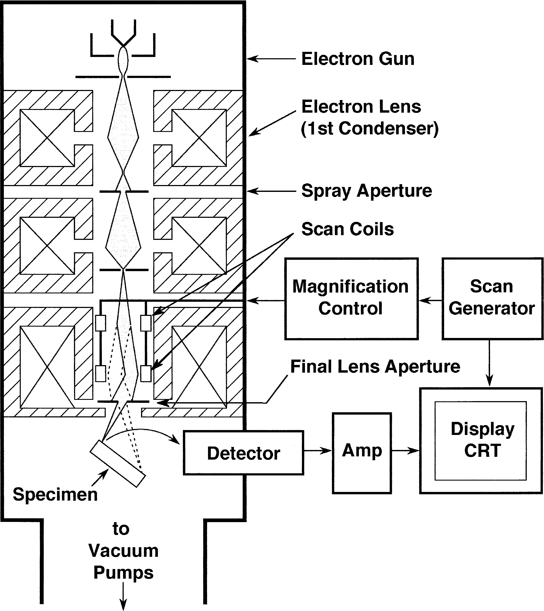

# 扫描电镜及其工作模式

## SEM工作原理

### 各部件功能

- 镜筒electron column

  - Electron Gun电子枪
  
    - Filament灯丝

  - Scan Coil扫描线圈
  - Electron Lenses电磁透镜
  - Specimen Stage样品台
  - Electron Detector探测器

- 控制台control console

  - 控制按钮
  - 显示器
  - 相机

#### 产生小电子束

电子枪产生电子，加速到0.1~30keV。电磁透镜将束斑会聚到10 nm内的小尺寸。电子束最终作用到样品表面1微米深度内，产生信号。

#### 偏转放大控制系统

扫描图像由一个个点构成，系统通过偏转线圈操控电子束在样品表面逐行扫描，与显示器CRT上的扫描同步。放大倍数为二者扫描步长之比，需要增大放大倍数时只需降低偏转线圈电流即可。

> 偏转控制系统。扫描生成器生成扫描的栅格，分别交给扫描线圈及显示器CRT。放大系统控制偏转线圈电流以控制放大倍数；探测器产生的信号经放大后交给CRT电子枪，控制发射强度。
> 
> （这东西现在应该已经被数字化了吧）

> 扫描线圈的工作原理：第一组偏转线圈令电子束偏离光轴，第二组再令电子束偏回来，与光轴重新相交的点称为中轴点(pivot point)。实际的放大倍数还与样品到中轴点的工作距离W有关，现代电镜可以实现自动校正放大倍数。

#### 探测器收集信号

电子束作用到样品上会产生各种各样的信号，信号强度与扫描点位相关联即可得到图像。最常用的信号是secondary electron二次电子SE和backscattered electron背散射电子BSE。标准Everhart-Thornley（E-T）探测器两种信号都能收集。

在探测器前的收集屏上施加正偏压可以同时收集到SE和BSE，施加负偏压则可以收集到纯BSE信号，这是由于SE的能量较低，会被挡出。电子由闪烁计数器或光电倍增管转成电信号，传给下一级系统。

#### 相机与计算机系统

（都什么年代了，还在用传统SEM）

#### 操作控制

- 控制电子枪的加速电压和电流强度
- 控制聚光镜，决定电子束的强度和最小束斑尺寸
- 控制物镜在样品上对焦
- 调整图像的衬度、亮度

### SEM成像模式

SEM提供多种成像模式，以适应不同信息。主要的四个参数：

- 束斑尺寸 $d_p$：对应分辨率模式resolution mode
- 束斑电流 $i_p$：对应高电流模式high-current mode
- 束斑会聚角 $\alpha_p$：对应焦深模式depth-of-focus mode
- 加速电压 $V_0$：对应低压模式low-voltage mode

#### 分辨率模式

束斑尺寸需要足够小以确保高分辨率，为获得足够的衬度，需要相应增大电流。为获得样品表面细节，束斑尺寸应与其尺度相当。分辨率模式只在高倍下（10000x以上）有意义。

#### 高电流模式

受噪声影响，样品的某些特征有时即便采用小束斑也无法得到良好衬度，此时增大电流以获得更高信号强度，从而获得更好的衬度。

另外，当需要收集X射线信号时，往往也需要增大电流以提高X射线信号强度。

#### 焦深模式

会聚角越小，焦深越好。小会聚角有利于不同深度样品的观察。

> 这个是景深吧，为啥写的是depth of focus

#### 低电压模式

低电压（< 5 kV）下，电子束与样品作用的范围基本限于近表面区域。因此低电压图像能获得更多的表面细节，相比之下高电压（15-30 kV）图像包含了样品内部信息

### 为什么需要了解电子光学

> 不如说是：为什么需要了解以上几种模式的优点，难道我们不能直接把电镜设置成同时具备以上所有优点吗？

以上参数的设置有些是互斥的。例如：小束斑和小会聚角不可避免地会降低电流；低电压下，束斑尺寸增大，电流也会降低。因此，我们需要了解各项参数、模式的意义及其对应的使用条件，从而灵活选择操作模式，获得更好的电镜照片。