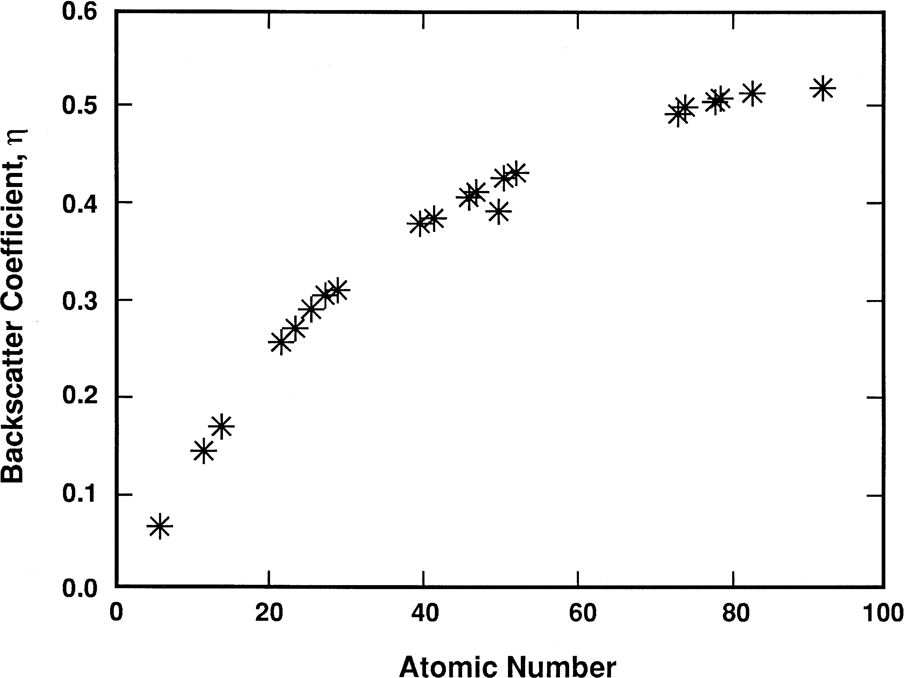
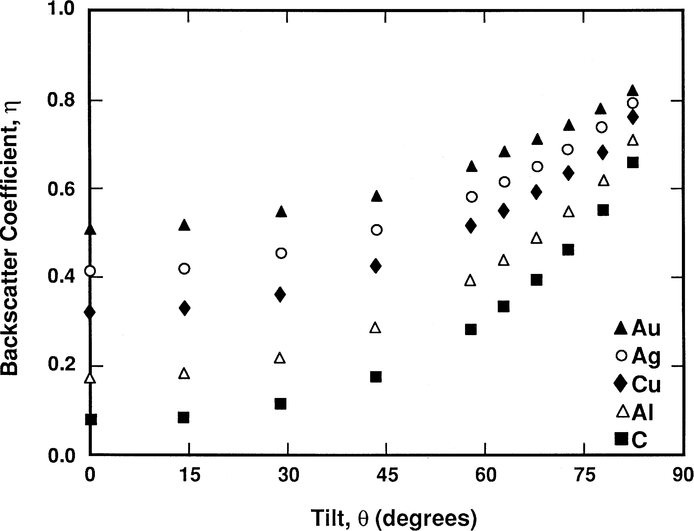
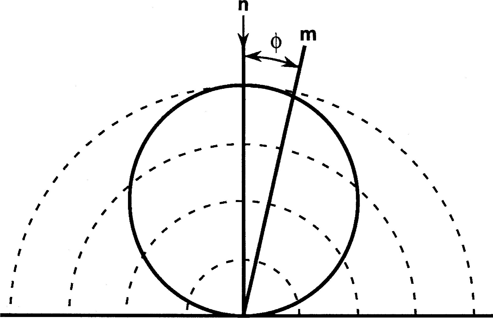
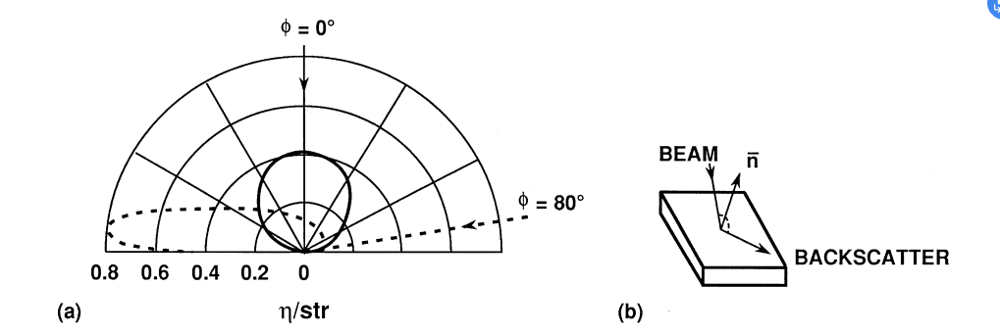
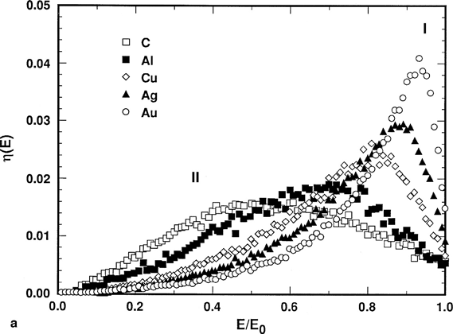
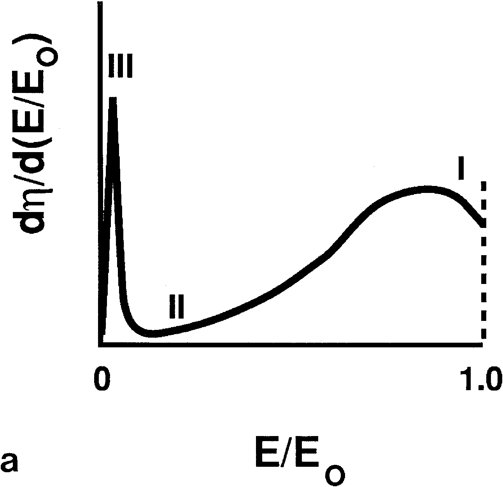
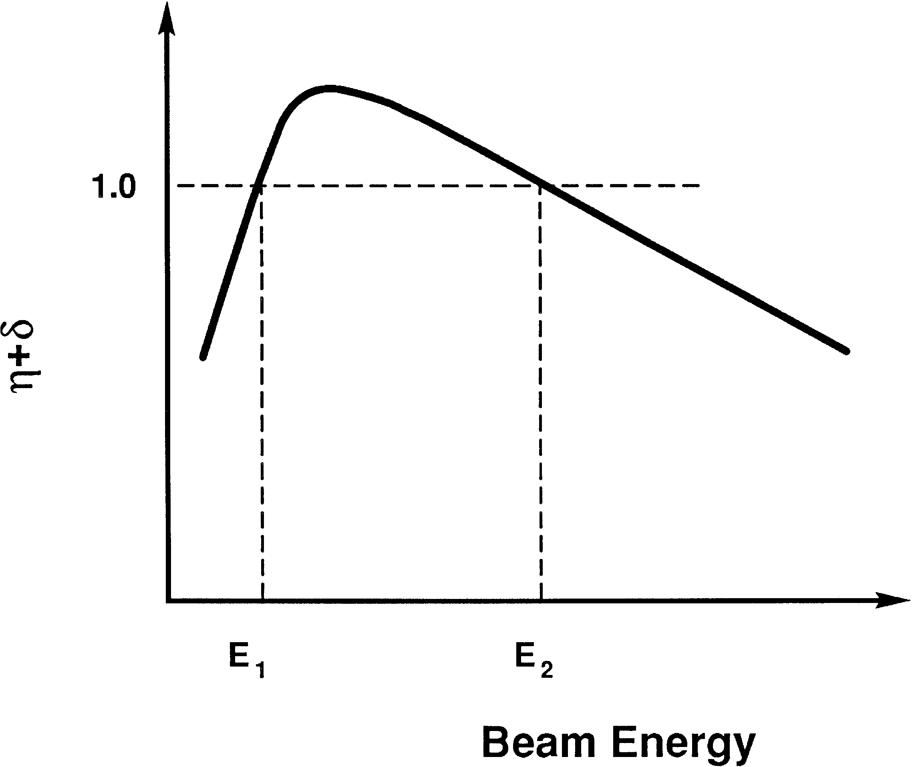
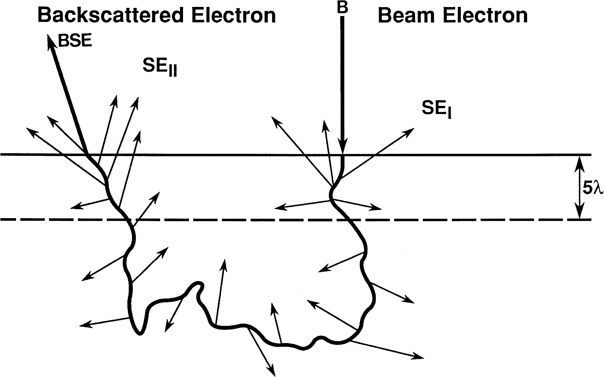
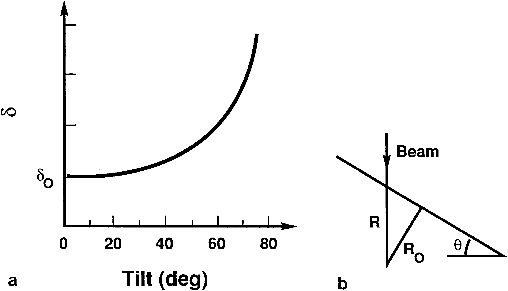

# 电子束-样品相互作用

## 进入样品的电子束

样品会对电子形成弹性散射，电子受到散射离开表面，称为背散射。电子受到散射的几率与原子序数的平方$Z^2$成正比，与电子能量的平方成反比。
$$
Q(>\phi_0)=1.62\times10^{-20}(Z^2/E^2)\cot^2(\phi_0/2)
$$
Q为单位原子区域内单个电子被散射到$\phi_0$外的几率，又称为**散射截面**。

平均自由程：$\lambda=N_0\rho Q$

## 电子束的作用范围

### 影响作用范围的参数

#### 束流能量

由于散射截面与能量平方反比，因此能量越强，作用范围越大。

#### 原子序数

原子序数越大，作用范围越小。

#### 样品表面倾转

表面的倾转会使得电子束作用的深度减小，同时出现不对称。

## 作用范围内的成像信号

### 背散射电子

- 定义：背散射电子产率$\eta$：
	$$
	\eta =\frac{n_{\text{BSE}}}{n_\text{B}}=\frac{i_{\text{BSE}}}{i_\text{B}}
	$$
	

#### 原子序数对背散射电子的影响

原子序数越大，背散射电子产率越高。

#### 电子束能量对BSE的影响

实际上，BSE产率对电子束能量并不十分敏感。总之很复杂。低能量的BSE信号还很容易受到碳污染。

#### 倾转角度对BSE的影响

倾转角度越大，产率越高。大致满足以下关系：
$$
\eta(\theta)=1/(1+\cos\theta)^p
$$
其中$p=9/\sqrt Z$

BSE电子产额和倾斜角度的关系成为了背散射像中形貌衬度的来源。‘

#### 背散射电子的角分布

对于正常垂直表面入射的电子束，BSE强度分布大致如下：

满足余弦关系：$\eta=\eta_n\cos\phi$

当不从法线方向入射时，BSE强度也会变得不对称，同时作用范围也会发生变化。

#### BSE的能量分布

- 能量分布从0能量和0损失能量都有
- 低能量损失的电子形成一个峰的分布
- 峰位随原子序数增大而右移，即原子序数越大，能量损失越少
- 轻元素的峰较宽
- 大多数的背散射电子保留了一半以上的能量，尤其是中、高原子序数的。

#### BSE横向空间分布

### 二次电子SE

#### 二次电子的产生

二次电子的能量较低，在总的能量分布图的低能位置形成一个尖峰。

能量低于50 kV的出射电子被归为二次电子，是原子外层弱束缚电子受入射电子非弹性散射供能、在样品内部传导、在表面被发射出来的电子。尽管50kV的能量范围也有BSE，但因为占比较小，就忽略了（而且也不影响）。

二次电子产额$\delta$：
$$
\delta=\frac{n_\text{SE}}{n_\text B}=\frac{i_\text{SE}}{i_\text B}
$$

#### 初级电子束产生的二次电子

二次电子产率随入射电子能量升高反而降低，由于能量降低，更多比例的一次电子作用在浅层，使得二次电子的产生效率提高。

#### 二次电子能量分布

（感觉没啥好说的，反正能量都不高

#### SE的范围与逃逸深度

受非弹性散射的影响，SE离开样品的概率随深度指数级别降低，即：
$$
p\approx\exp(-\frac{z}\lambda)
$$

> - $z$ ：深度
> - $\lambda$：SE的平均自由程

SE的区域大致在$5\lambda$深度左右。同时，BSE出射也会产生二次电子，产率好像比入射还多。
$$
\delta_T=\delta_1+\delta_2\eta
$$

- BSE能量更低，方向不定，在厚度范围内路径更长
- 一般来说$\eta_2/\eta_1$按3倍算

#### SE随样品成分的变化

一般没啥变化。但在某些条件下，尤其是能量较低时，对许多名义上的绝缘体，SE可以有超过1的产率。同时，SE也会受到化学键、半导体掺杂、晶体取向、电导率、晶体表面完美程度等因素的影响，~~太复杂就不管了。~~

#### SE随表面倾斜角的影响

$$
\delta(\theta)=\delta_0\sec\theta=\delta_0/\cos\theta
$$

还是和深度有关系。

#### SE发射的角分布

区别于BSE，由于SE的产生更加各向同性，即使样品表面倾斜，SE在表面仍然呈余弦分布。
