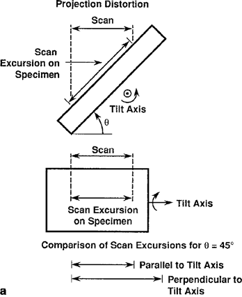

# SEM成像

## 基本成像过程

电子束主要有以下三个参数：

- $d$：束斑尺寸
- $i_\text B$：电子束电流
- $\alpha$：会聚角

控制电子束扫描样品，记录对应位置产生信号的强度，最终形成图像。放大倍数由CRT扫描步长与样品扫描步长的比值决定。

### 图像的放大

由于CRT大小基本上固定，因此改变的基本上是样品扫描步长。放大倍数与扫描步长一一对应。需要注意的是，放大的同时，扫描样品的范围也会缩小，因此在搜索样品时需要较小的倍数。同时，由于在放大时仅仅改变了扫描线圈的工作状态，因此不需要调整物镜对焦。同时，如果保持物镜电流不变，且工作距离固定，图像也不会发生旋转。

### 像素

像素大小和扫描步长相关。

有效束斑尺寸$d_{eff}=\sqrt{d_\text B^2+d_\text{BSE}^2}$

原子序数大的样品，有效束斑尺寸小。

### 低倍模式

低倍模式下，束斑尺寸远小于像素。

需要注意的问题是：在先前的分析中可以发现，当束斑尺寸很小时，束斑电流也会变小，这将影响之后的信号产生与成像，降低衬度。同时，束斑尺寸相比于产生BSE的尺寸可能更小，后者更主要，所以可以适当减弱C1电流，增大束斑尺寸，以增大电流。

### 景深

扫描电镜一般景深很大，因为放大倍数小。
$$
D\approx2r/\alpha
$$
r为像素对应样品区域的大小，$r=0.1\text{ mm}/M$

小光阑有利于大景深。

### 图像的畸变

#### 投影畸变：中心投影

对于转动电子枪进行扫描的电镜，拍出来的电镜照片可以等效为光源位置的中心投影，区别于平行投影。

{width=300}
$$
S_x=WD\tan\phi
$$

#### 投影畸变：图像缩短

倾转导致样品的图像（3D结构的2D投影）长度发生畸变。

当放大倍数很大时，扫描区域小，扫描角度近似为垂直平行入射。电镜中图像的长度不能反映真实长度，需要通过余弦关系进行转换。

当已知倾斜角度和样品大致形状（如平面）时，可以开启电镜的倾转校正功能。不过这个对复杂样品好像没用，如上图的d，尽管铜网经过校正后恢复了方形，但橡胶球畸变成了椭圆。

倾斜的一个问题是，使得样品超出电镜的景深范围。部分电镜带有动态对焦功能，保持样品对所有点都在聚焦范围内。

#### 扫描畸变

在扫描过程中由于各种奇怪的原因（比如两个线圈没配合好），导致图像出现失真。例如：图像边缘产生的畸变。

#### 摩尔纹

采样率低于源信号频率时出现的条纹（信号处理观点）。当样品具有条纹结构，且放大倍数不够的时候就会出现。

## 探测器

探测器的四大要素：

- 探测器的位置（相对于样品和电子束）
- 探测器的大小（探测范围大小）
- 探测器将电子、X射线等信号转化为可用数据的能力
- 探测器的速率（带宽、高频特性）

### 电子探测器

主要关注SE和BSE两块。BSE能量分布从0到E0都有，对中高原子序数的样品大约在0.7~0.9E0处有峰。SE能量小于50eV，3~5eV最多，90%在10eV以下。两种信号的差异其实对电子探测器提出了相当大的挑战。不过也给区分两种信号带来了可能。

#### E-T探测器

Everhart-Thornley探测器是SEM上广泛使用的探测器。E-T探测器对SE效果好，但对BSE也很好。

（计数原理反正就是闪烁计数器+光电倍增管，不想管了）

在闪烁计数器上装了个法拉第笼，防止施加的偏压对电子束产生干扰。施加正250偏压用于收集SE，-50偏压用于排斥SE。

- 施加负偏压时：只收集BSE信号，所有的SE都被排斥。同时探测器的空间采集效率降低，因为只有较小空间角范围的BSE才能被收集到。需要调整探测器位置以获得好的图像。

	

- 施加正偏压时：SE和低能BSE都会被吸引过来。同时，更大方向上的信号都能被收集到。同时，各种乱七八糟的SE（包括BSE打到极靴上产生的）都会被收集进来。

#### TTL探测器

TTL受BSE影响更小，主要收集SE信号。

## 样品、探测器与衬度的关系

### 衬度

衬度有一个定义式：
$$
C=(S_2-S_1)/S_2,\ \ \ \ \ S_2>S_1
$$
衬度受到电子束-样品作用、样品特性、信号特性、探测器位置、探测器大小、探测器响应等复杂因素的影响。有3种衬度测量方法（衬度组成）：

- 数值组成：离开样品的电子的数值差异
- 路径组成：离开样品的电子路径导致的差异
- 能量组成

### 成分衬度

#### BSE的成分衬度

不同元素组分的$\eta$不同。

原子序数衬度的特性如下：

- 原子序数越大的地方越亮
- 原子序数衬度的大小是可预测的，$C_Z=(\eta_2-\eta_1)/\eta_2$
- 原子序数越大，相邻原子的衬度差异越小
- 样品的倾转也会影响成分衬度，掠入射时不同元素的背散射系数趋于一致，衬度随倾斜度增加而减小。
- 背散射电子的方向分布也会对衬度有影响，需要相应调整探测器位置。

### 形貌衬度

#### 来源

形貌衬度主要有3个来源：

- 背散射系数随倾斜角度增大而增大
- 背散射电子的角度分布也与表面倾斜角度有关（衬度的路径组成）
- 二次电子系数随倾斜角度有正割规律（但是二次电子角度分布和倾斜角度关系不大）

#### E-T探测器探测形貌衬度

##### 背散射电子分量

E-T探测器开负偏压就可以排除SE的影响。有3个性质：

- 探测器在样品一侧，因此具有各向异性的视场
- 探测器立体角较小，只能收集部分BSE
- 探测器与样品角度较小，与电子束角度大

信号具有很强的方向性，有些会被遮挡而无法到达探测器，造成局部地区域没信号。总体而言比较粗糙。

##### BSE+SE

施加正偏压使得SE可以被收集。信号实际上包括直接BSE、SE和间接BSE

SE衬度与形貌强相关
$$
\delta=\delta_0\sec\theta\\
C\sim d\delta/\delta=\tan\theta d\theta
$$

#### 光路等效

需要尽量调整探测器位置以实现顶部照明，这样可以图像更好理解。因为现实中的光一般都是从上往下的。

## 图像质量

形成图像的条件：

- 衬度信息不会被噪声掩盖
- 应用图像处理技术使得放大信号中的衬度可见

图像处理这块不想看了（
