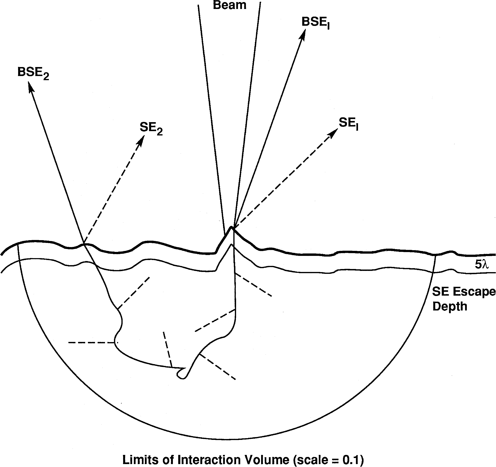
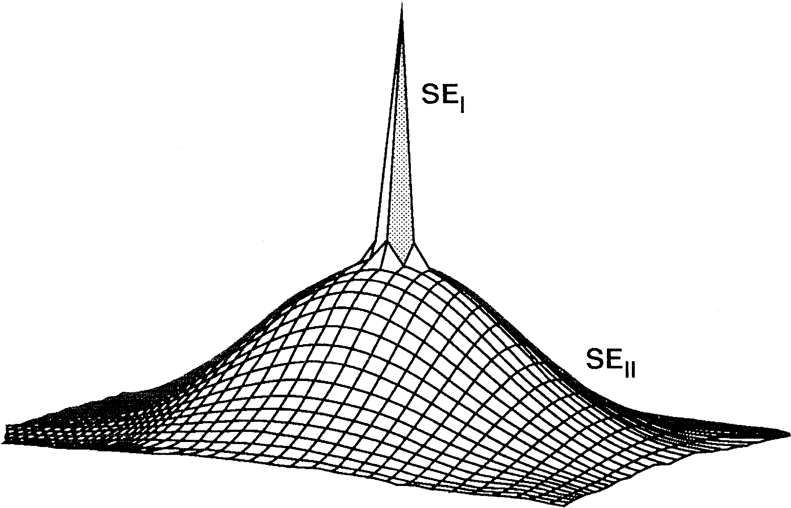
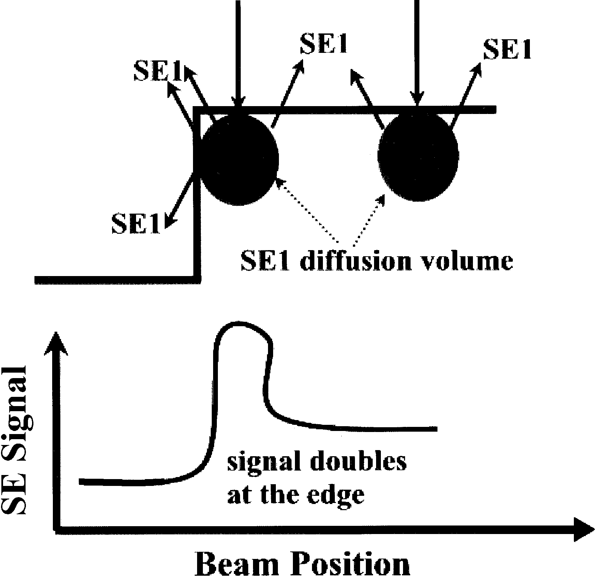
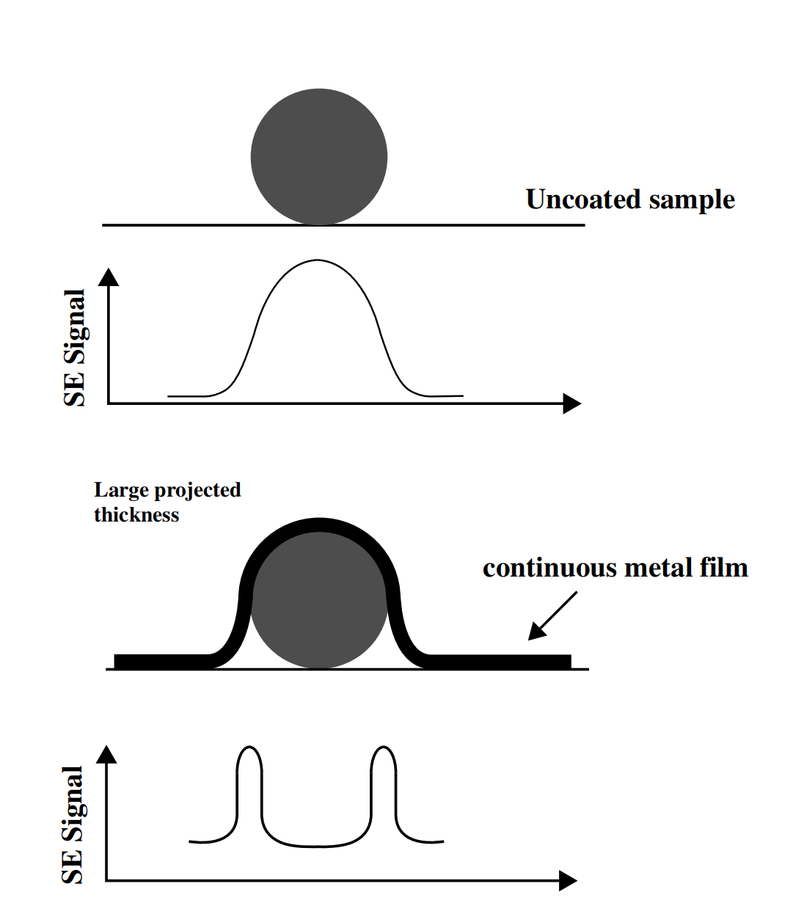
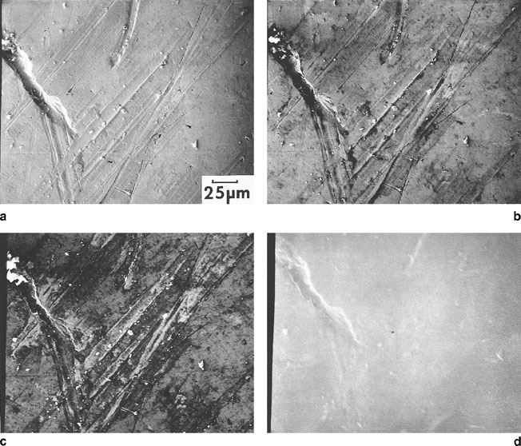
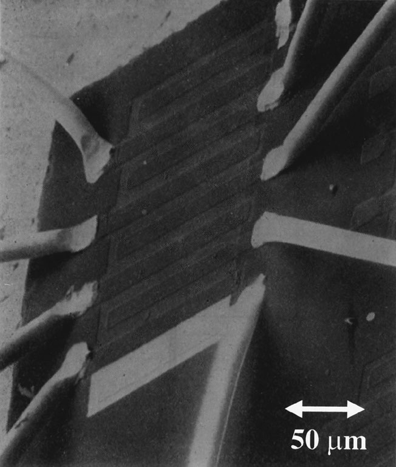
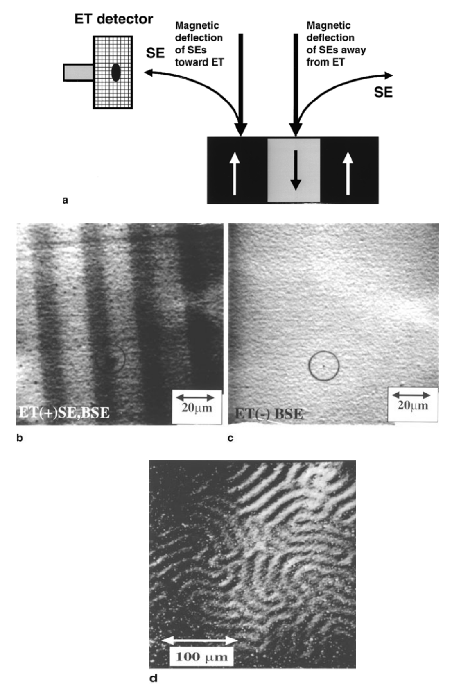
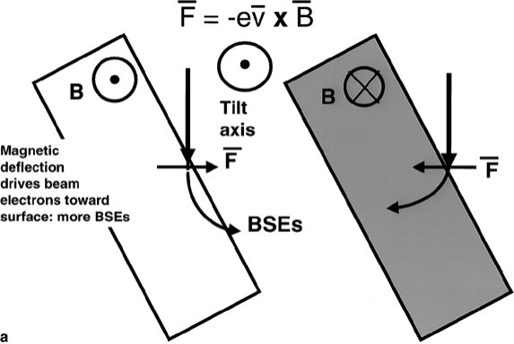
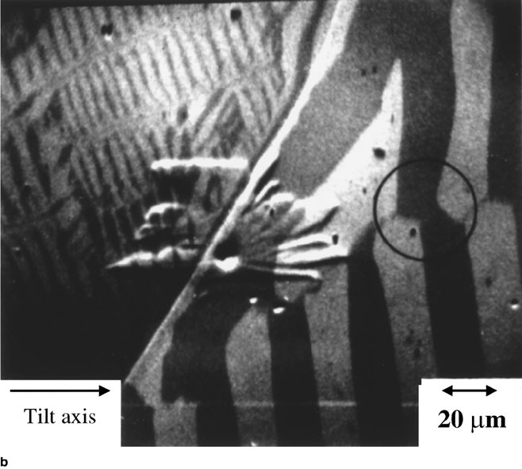
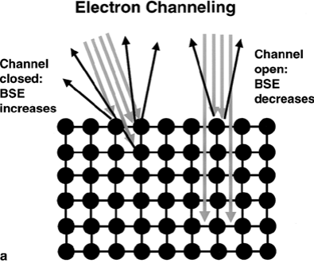

# SEM中的一些特殊情形

## 高分辨成像

### 分辨率问题

需要将高分辨信号从低分辨信号中提出来。

另外，产生信号的区域大小也是影响分辨率的重要因素。

### 高束流能量下的高分辨率

二次电子产生的分布如下：

SE1较为集中，而SE2较分散。在低倍下，由于扫描步长大，像素大，样品特征主要靠SE2反映。在高倍下，步长减小，像素间SE2差别小，SE1差别大，主要靠SE1。SE2信号作为噪声，会降低信噪比。

对于低原子序数的样品（如高分子、生物样品等），为提高信噪比，常常在表面沉积一层金属（3-5 nm）。在10万倍以下，一般的沉积方法都没问题，但更大的放大倍数下可能会产生一些假象。为避免假象，必须使用先进的沉积技术，离子束沉积等。

样品边缘处的信号具有2倍的强度

### 低压下的高分辨率

降低电压可以减小电子束的作用范围，使得SE2、BSE2组分的分布收窄，就不必区分SE1和SE2。

## STEM-in-SEM

怪

## 低电压下的表面成像

降低束流能量以减小电子束与样品的作用范围，这也是实现表面高分辨成像的重要策略。

> abcd电压分别为20、10、5、1 keV
>
> 前三个依次变好，1 keV太小了

## SEM中的尺寸测量

（好像是拿个东西标定一下

## SEM三维重建

直接观测到的结果是二维的图像，但人们可能更加关心三维的结构。SEM的大景深有利于形成二维图像，但也使得三维的信息被损失，需要额外的技术。

### 定性的三维成像

在不同的视角下看到的图像不同，从中可以提取出三维信息。

### 定量的三维成像

不想看了（

## 可变气压及环境电镜

无须高真空，可以观测含水样品的电镜。

使用了特殊的真空设计，及可以在低真空下使用的二次电子探测器。

## 特殊的衬度机制

除了形貌和成分，还有别的衬度机制，如电场、磁场、晶体结构等。

### 电场衬度

> 电路的电压衬度，由正偏压的E-T探测器收集，越亮的地方电势越负。

另外，荷电也会对衬度产生影响。

### 磁场衬度

#### 第一类磁衬度

第一类磁衬度是：**离开表面的二次电子和漏磁场相互作用**产生的衬度。若磁场令电子远离探头，则衬度偏暗，反之则偏亮。

#### 第二类磁衬度

第二类磁衬度源于**内部磁场对电子束的影响**，主要影响电子束在样品内部的散射。

### 晶体学衬度

通道效应也会产生衬度。如图所示：

同时，低倍下的扫描也会使入射角度发生变化，从而产生衬度。

## 电子背散射衍射EBSD

收集背散射电子的菊池花样，可以标定晶体的取向、相成分鉴别。
